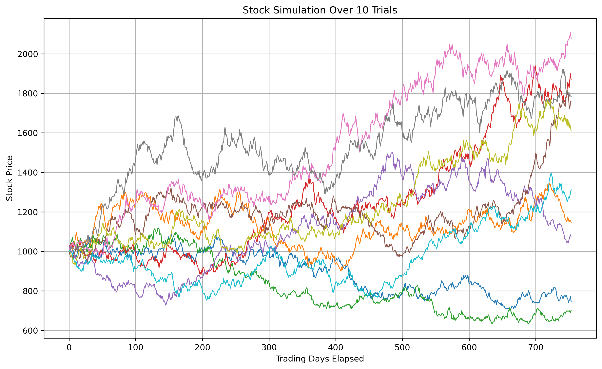

# Monte Carlo Simulation of Stock Prices as Geometric Brownian Motion

We simulate several possible stock price paths using the standard Geometric Brownian Motion model, then analyze the distribution of final stock prices.

The goal of this project is to built intuition with the fundementals of quantitative finance, and provide a foundation for future work in my portfolio.

---

## Model

We assume that stock prices follow Geometric Brownian Motion, as defined by the stochastic differential equation:

$dS_t = \mu S_t dt + \sigma S_t dW_t$

where:
- $S_t$ is the stock price
- $\mu$ is the expected return ("drift")
- $\sigma$ is the volatility
- $dW_t$ is a "brownian motion increment" known as a Wiener process

---

## Simulation

We can solve the stochastic differential equation equation for the final price in terms of the Wiener process increments:

$S_t = S_{t - \Delta t} \exp((\mu - \frac{1}{2}\sigma^2) dt + \sigma dW_t)$

We can use this analytical solution to calculate the stock trajectory and final price over several simulations.

---

## Terminal Price Analysis

After performing a large number of simulations, we can do data analysis on the final prices to get an idea for what returns are expected from our investment. The program calculates and displays several percentiles of interest, as well as the average over all trials.

---

## Visualization of Simulated Paths

Here's an example plot generated by this project. It forecasts 10 possible stock trajectories over three years of trading.

